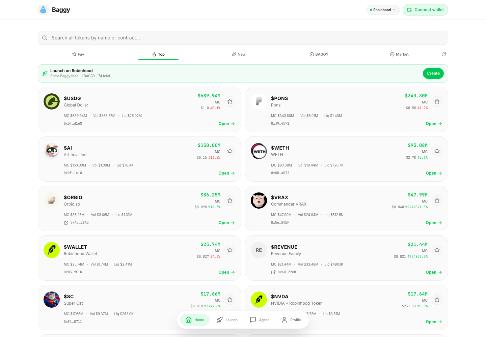
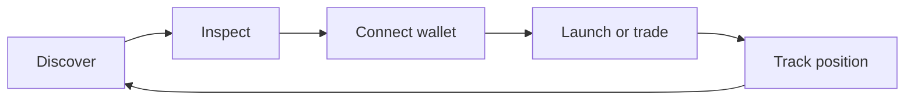
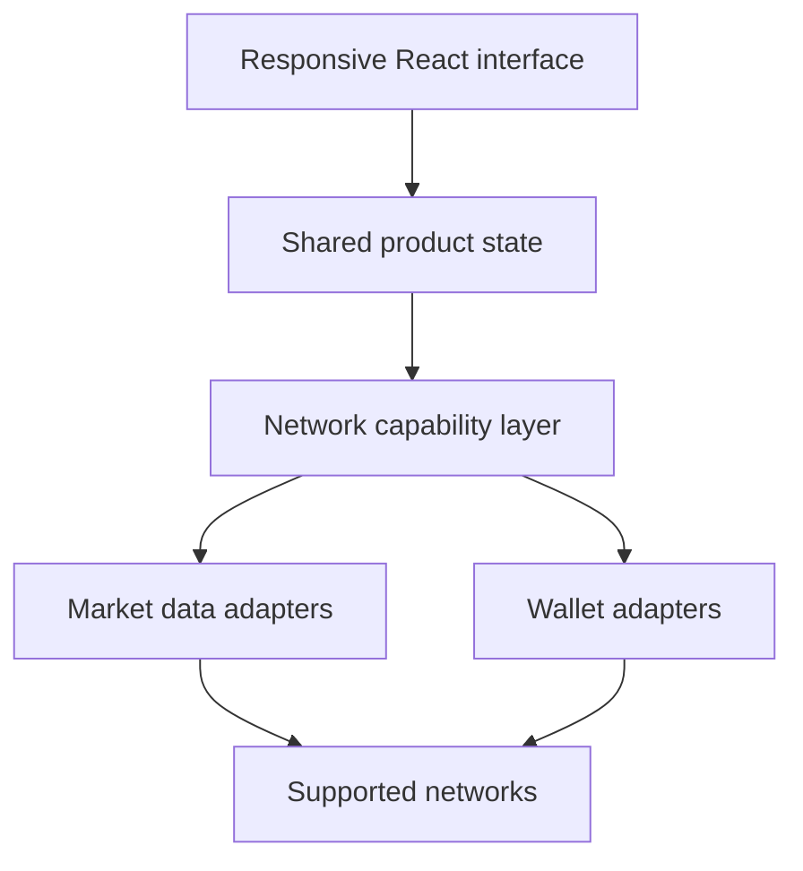
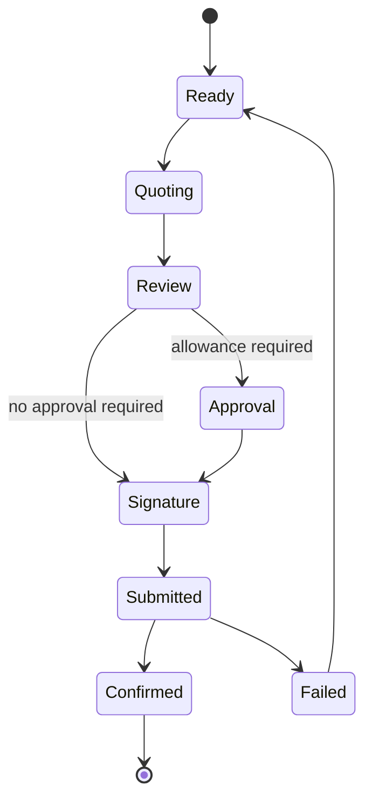

<div align="center">
  

# Baggy

### Discover, launch, and trade tokens without breaking the flow.

[Live product](https://baggyapp.win) · [Telegram](https://t.me/BaggyApp_bot)

</div>

Baggy is a non-custodial, multi-chain launchpad and trading workspace built for fast-moving token markets. It brings discovery, wallet connection, token launches, trading, and portfolio context into one consistent product.

The goal is simple: reduce the distance between finding a token and acting on it, while keeping the user in control of every transaction.



## The problem

Token discovery and execution are usually fragmented across feeds, explorers, launchpads, wallets, and trading interfaces. That creates three recurring problems:

- users lose context while moving between tools;
- new chains and launch venues require different interaction patterns;
- speed often comes at the expense of clarity and control.

Baggy turns that fragmented journey into one continuous flow.



## Product preview

<table>
  <tr>
    <td width="50%" align="center">
      
      <br /><strong>Mobile discovery</strong>
    </td>
    <td width="50%" align="center">
      
      <br /><strong>Wallet-gated launch</strong>
    </td>
  </tr>
</table>

## Product experience

### One feed across ecosystems

Users can switch between supported networks without relearning the product. The selected ecosystem changes token discovery, wallet behavior, launch availability, and execution routes while the core navigation stays familiar.

### Non-custodial by design

Baggy does not take custody of user funds. Wallets remain the source of identity and authorization, and every state-changing transaction requires an explicit signature.

### Token discovery

The feed helps users move from market activity to a token page with relevant identity, liquidity, price, and social context. Favorites and portfolio views make it easier to return to active ideas.

### Launch flow

Creators can prepare token metadata, review launch inputs, sign from their wallet, and follow the resulting asset from creation into the market interface.

### Trading flow

Token pages bring quote context, transaction state, explorer links, and portfolio feedback into the same experience. The interface is designed to keep execution understandable on both desktop and mobile.

### Telegram-native access

Baggy also supports a compact Telegram experience for discovery, wallet actions, and trading workflows where a mobile-first surface is more natural.

## Supported product surfaces

| Surface | Purpose |
|---|---|
| Feed | Discover active and newly launched tokens |
| Token page | Inspect market context and prepare an action |
| Launch | Create a token through a guided wallet-signed flow |
| Trade | Request a quote, review it, and sign the transaction |
| Portfolio | Follow balances, positions, and recent activity |
| Profile | Manage wallet context, favorites, and referrals |
| Telegram | Use the core product loop from a compact mobile interface |

## Design principles

- **One mental model:** networks may differ, but navigation and action hierarchy stay consistent.
- **User-controlled execution:** the connected wallet signs every transaction.
- **Context before action:** token identity and market information remain visible around launch and trade decisions.
- **Clear transaction states:** pending, successful, failed, and unsupported states are explicit.
- **Mobile-first speed:** primary actions remain reachable in compact Telegram and browser layouts.
- **Progressive disclosure:** advanced information appears when it helps instead of overwhelming the first screen.

## UI rationale

Baggy is designed for repeated, time-sensitive use rather than for a marketing-style first impression. The interface therefore favors scan speed, predictable placement, and restrained visual hierarchy.

| UI decision | Reasoning |
|---|---|
| Persistent network selector | Network context changes balances, wallets, token addresses, and available actions. Keeping it visible reduces accidental cross-network assumptions. |
| Search before navigation | Contract search is often the fastest path for an experienced user, so it remains a first-class control instead of living behind a separate page. |
| Compact filter row | Favorites, top tokens, new launches, and market views are modes of the same feed. A compact row makes comparison faster without turning each mode into a new route. |
| Two-column desktop feed | Wide screens should increase useful density. Two columns allow more tokens to be compared while preserving readable row structure. |
| Single-column mobile feed | Mobile layouts keep one clear reading direction and reserve horizontal space for token identity, valuation, and the primary action. |
| Bottom navigation | Home, Launch, Agent, and Profile stay inside the easiest thumb-reach area and remain stable between product states. |
| Wallet gating before launch | A launch cannot complete without an eligible wallet. Showing that requirement before a long form prevents dead-end effort and clarifies the trust boundary. |
| Green as an action signal | The accent is concentrated on actionable, successful, or connected states. It is not used as general decoration, so it keeps semantic value. |
| Neutral token surfaces | Token imagery and market movement already create visual noise. Quiet surfaces make symbols, prices, liquidity, and state changes easier to scan. |
| Explicit external links | Explorer and social destinations use recognizable outbound behavior so users understand when they are leaving Baggy. |

### Information hierarchy

Every token result follows the same reading order:

1. identity: image, symbol, and name;
2. current value: price or capitalization with directional movement;
3. decision context: liquidity, volume, and shortened contract;
4. action: open the token workspace.

This order mirrors the questions a user asks under time pressure: *Is this the right token? What is it doing? Is the market usable? Where can I act?*

### Responsive behavior

The desktop and mobile versions are not separate products. Components keep the same semantics while changing density and placement. Filters remain recognizable, token rows preserve their information order, and the primary action never moves into an unfamiliar menu solely because the viewport changed.

### Trust through visible states

Crypto interfaces become dangerous when uncertainty looks like success. Baggy treats connecting, loading, quoting, approving, signing, confirming, failing, and unsupported as distinct UI states. Disabled controls explain what is missing, and transaction outcomes lead to an explorer reference when one is available.

## Selected engineering highlights

This showcase intentionally describes the implementation only at a high level.



### Multi-chain product model

Network-specific discovery, wallet, launch, and trading behavior is exposed through a shared product interface. This keeps ecosystem differences at the integration boundary instead of spreading chain-specific conditions throughout the UI.

The application resolves a selected ecosystem into a capability set rather than assuming every chain supports every action. The UI can therefore ask whether discovery, launch, direct trading, portfolio data, or a particular wallet flow is available before rendering the command.

Conceptually, the boundary looks like this:

```text
selected network
  -> network definition
  -> supported capabilities
  -> wallet adapter + data adapter
  -> shared token and transaction models
  -> reusable product components
```

This model was chosen because adding a network should primarily mean implementing an adapter and declaring capabilities, not duplicating the entire product.

### Wallet-aware state

Connection state, selected ecosystem, balances, and transaction progress are coordinated across navigation so users do not lose context when moving between discovery, launch, trade, and profile views.

Solana and EVM wallets expose different connection and signing mechanics, but the interface consumes a common set of product states: disconnected, connecting, connected, wrong network, awaiting signature, submitted, and confirmed. Keeping protocol details behind wallet adapters allows the UI copy and recovery paths to stay consistent.

### Resilient market data

Market information is normalized before it reaches product components. Loading, stale, missing, and unsupported data remain visible states rather than silently producing misleading UI.

Provider responses are mapped into a shared token model containing identity, market values, liquidity, volume, pair context, and provenance. Components do not read provider-specific payloads directly. This makes fallback behavior testable and prevents a feed redesign whenever an upstream schema changes.

Remote queries use bounded caching and controlled retry behavior. Frequently revisited screens can render recent data immediately while a refresh happens in the background, but unsupported or absent fields stay absent instead of being replaced with unrelated values.

### Transaction safety

Quotes, network checks, approvals, slippage limits, and explorer references are presented before or alongside wallet signing. External wallets remain responsible for final authorization.

The transaction flow is modeled as a sequence rather than a single button callback:



Separating these states supports precise feedback, safer retries, and correct behavior when a user rejects a wallet request or changes networks mid-flow.

### Responsive delivery

The same product supports a wide browser workspace and a compact Telegram-oriented layout. Navigation and density adapt while the underlying user journey remains consistent.

The application shell owns network selection, wallet status, connectivity feedback, and primary navigation. Product tabs render inside that stable shell, which avoids remounting global context during ordinary navigation and keeps wallet state available across the flow.

Less frequently used routes are loaded on demand. A route-level error boundary provides a recoverable failure screen instead of leaving the application blank if an isolated feature fails to initialize.

## Simplified implementation examples

The following examples are deliberately reduced to the architectural idea. They are not copied from production transaction code and contain no provider configuration, contract details, or operational logic.

### 1. Render features from network capabilities

**Problem:** a control can look available even though the selected network cannot complete the action.

**Decision:** resolve the network into explicit capabilities, then let components render from that contract instead of checking chain names throughout the UI.

```ts
type NetworkCapabilities = {
  discovery: boolean;
  launch: boolean;
  directTrade: boolean;
  portfolio: boolean;
};

type ProductNetwork = {
  id: string;
  label: string;
  capabilities: NetworkCapabilities;
};

function NetworkActions({ network }: { network: ProductNetwork }) {
  return (
    <nav>
      {network.capabilities.discovery && <FeedAction />}
      {network.capabilities.launch && <LaunchAction />}
      {network.capabilities.directTrade && <TradeAction />}
    </nav>
  );
}
```

**Why it matters:** adding or temporarily limiting a network changes one capability definition instead of producing scattered conditions across feed, navigation, and token pages. Users see fewer dead controls and clearer expectations.

### 2. Normalize provider data before rendering

**Problem:** market providers use different field names, null behavior, image sources, and numeric formats. Rendering raw responses directly makes cards inconsistent and fragile.

**Decision:** map every supported response into one small product record and preserve provenance.

```ts
type TokenRecord = {
  address: string;
  symbol: string;
  name: string;
  image?: string;
  priceUsd?: number;
  liquidityUsd?: number;
  source: string;
};

function normalizeToken(input: ProviderToken): TokenRecord {
  return {
    address: normalizeAddress(input.address),
    symbol: cleanSymbol(input.symbol) ?? "UNKNOWN",
    name: cleanName(input.name) ?? "Unknown token",
    image: resolveVerifiedImage(input),
    priceUsd: toPositiveNumber(input.priceUsd),
    liquidityUsd: toPositiveNumber(input.liquidityUsd),
    source: input.provider,
  };
}
```

**Why it matters:** feed cards and token pages consume the same predictable shape. Missing values remain missing, token identity can be checked once, and an upstream schema change is isolated inside its adapter.

### 3. Model a transaction as explicit states

**Problem:** launch and trade actions can pause for a quote, allowance, wallet signature, network confirmation, rejection, or failure. A single `loading` boolean cannot explain what is happening or what the user should do next.

**Decision:** use a finite set of states and render the primary action from the current state.

```ts
type TransactionState =
  | "ready"
  | "quoting"
  | "review"
  | "awaiting_approval"
  | "awaiting_signature"
  | "submitted"
  | "confirmed"
  | "failed";

function transactionLabel(state: TransactionState): string {
  const labels: Record<TransactionState, string> = {
    ready: "Review trade",
    quoting: "Getting quote...",
    review: "Confirm in wallet",
    awaiting_approval: "Approve token",
    awaiting_signature: "Waiting for signature",
    submitted: "Transaction submitted",
    confirmed: "Trade confirmed",
    failed: "Try again",
  };

  return labels[state];
}
```

**Why it matters:** the interface can distinguish waiting from failure, rejected signatures from network errors, and submitted transactions from confirmed ones. Recovery actions become precise instead of asking the user to repeat the whole flow.

## Key implementation decisions

| Decision | Why it was chosen | Product effect |
|---|---|---|
| React with TypeScript | The product has many stateful flows and network-dependent branches; typed component contracts reduce accidental state mismatches. | Safer iteration across feed, token, launch, trade, and wallet surfaces. |
| Vite client build | Fast local feedback and a compact production pipeline suit an interaction-heavy single-page application. | Faster design iteration and predictable static delivery. |
| Query cache separated from UI state | Remote market data and local interaction state have different lifecycles. | Background refreshes do not reset navigation or unfinished user input. |
| Chain adapters | Solana and EVM networks differ at the protocol boundary, not at the level of user intent. | Shared UI with network-specific execution. |
| Capability-driven rendering | A feature should appear only when the selected network can complete it. | Fewer dead controls and clearer network expectations. |
| Normalized token records | Provider payloads vary in naming, completeness, and freshness. | Consistent cards, search results, and token pages. |
| Route-level lazy loading | Admin and callback surfaces are not needed for the first product view. | Smaller initial work and faster access to the feed. |
| Explicit error boundary | Wallet and provider integrations can fail independently of the rest of the UI. | A recoverable message replaces a blank application. |
| External signing | Custody and transaction authorization stay with the user's wallet. | Clearer security boundary and user control. |

## State ownership

Baggy separates state by responsibility:

| State type | Examples | Ownership |
|---|---|---|
| Session | selected ecosystem, active tab, temporary trade target | application shell |
| Wallet | connection, account, chain, balances, signing status | wallet context and adapters |
| Remote data | feeds, token details, quotes, portfolio reads | query layer |
| Persistent preference | favorites, selected ecosystem, trading preferences | scoped browser storage or account storage |
| Transaction | quote, approval, signature, submission, confirmation | feature-level state machine |

This separation prevents a feed refresh from clearing a wallet connection, a route change from losing transaction progress, or a network switch from reusing incompatible token state.

## Verification approach

The private production repository uses several complementary checks:

- unit tests for chain definitions, routing, metadata normalization, and social-link handling;
- adapter tests for wallet connection and quote behavior;
- contract-facing tests for launch discovery and transaction preparation;
- TypeScript project checks to validate cross-feature contracts;
- production builds to catch bundling and route-loading regressions;
- manual desktop and mobile passes for wallet prompts, disabled states, and responsive density.

The goal is not only to prove that a function returns the expected value. The tests protect boundaries where a wrong network, mismatched token identity, stale provider response, or interrupted signing flow could create misleading product behavior.

## Technology snapshot

| Area | Technology |
|---|---|
| Client | React, TypeScript, Vite |
| Product state | TanStack Query and typed application state |
| Wallets | WalletConnect and ecosystem wallet adapters |
| Networks | Solana and EVM-compatible chains |
| Interface | Responsive web app and Telegram Web App |
| Validation | Automated unit tests, type checks, and production builds |

## What is intentionally private

This repository is a product and engineering showcase, not the production source repository. It does **not** publish:

- smart-contract source or deployment configuration;
- contract addresses, routing rules, or launch parameters;
- private provider integrations and internal API contracts;
- infrastructure configuration, secrets, or operational tooling;
- admin systems, user data, or production analytics;
- anti-abuse and transaction-protection internals.

These boundaries keep the public case study useful without exposing security-sensitive or commercially important implementation details.

## Current status

Baggy is an active product project. The browser experience is available at [baggyapp.win](https://baggyapp.win). Individual network capabilities can differ, and launch or trading availability depends on the connected wallet, selected network, liquidity, and current integration status.

## Repository scope

The repository documents the product problem, user journey, design principles, and selected engineering decisions. Production development continues in a private repository.

## Author

Built by [0xENTYPER](https://github.com/0xENTYPER).
